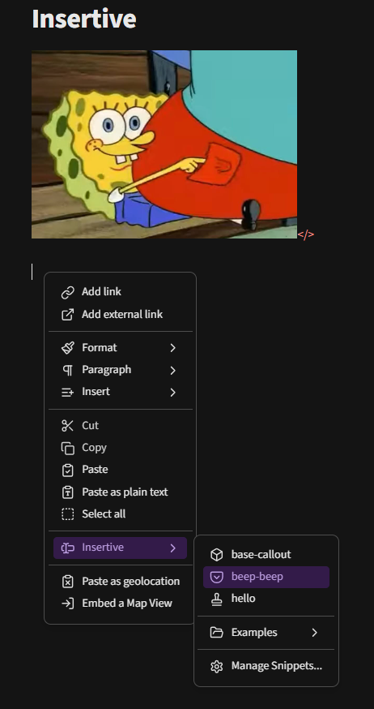
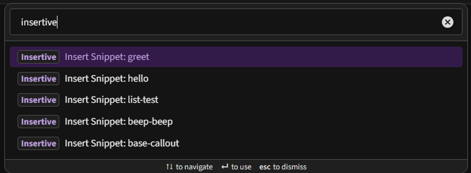

# Insertive
_An Obsidian plugin that allows users to insert named snippets._  

This plugin provides a no-nonsense way to store and recall plain text (e.g. callouts, base codeblocks, etc.) without the complexity of [Templater](https://github.com/SilentVoid13/Templater).  
Store predefined text and then quickly paste it in with keybinds, the command palette or a right-click context menu.  


## Quick Start

- Install (use [BRAT](https://github.com/TfTHacker/obsidian42-brat)) and enable the plugin
- Go to the Insertive settings and add a new snippet
- Close the settings window and go to a note
- Right-click, scroll over "Insertive" and click your named snippet


## Assign Hotkeys

- Make a snippet
- Open the Hotkeys options
- Search for "insertive" or "insert snippet"
- Assign a hotkey


## Features and Examples

Choose from the context menu (and assign [Lucide icons](https://lucide.dev/icons/)).  

</>  


Choose from the Command Palette (hotkey assignable).  
</>  

Similar snippets can be grouped together in their own submenu using the "Group" setting (e.g. "Examples" in the screenshot above).  

(Very) limited support for variables.  
_NOTE: I do not intend to expand any more support for this feature._  

Insertive ships with a `greet` example snippet:
Select a word (e.g. "Plankton") and choose the "greet" snippet to convert the selected word to "Hello Plankton (from Insertive)".

Similarly, this `list-test` example snippet will convert 3 selected lines into a bulleted list.  

Snippet Text:
```
Three-Item List Example
- {1}
- {2]
- {3}
```


## AI Use Disclosure
This project was a little experiment to test the collaborative code-writing abilities of [Claude](https://claude.ai/) (free; Sonnet 4.5) and [Grok](https://grok.com) (mostly used to review and make suggestions) to produce a fully functional Obsidian plugin with _absolutely no human-written code_.    
I'm pretty happy with the results.  
